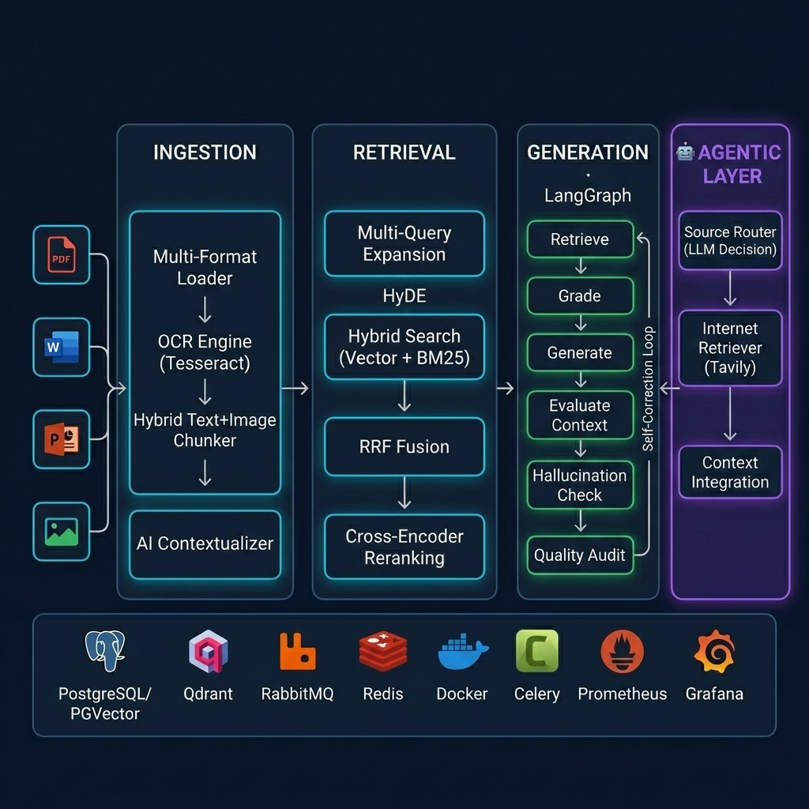
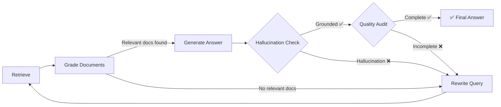
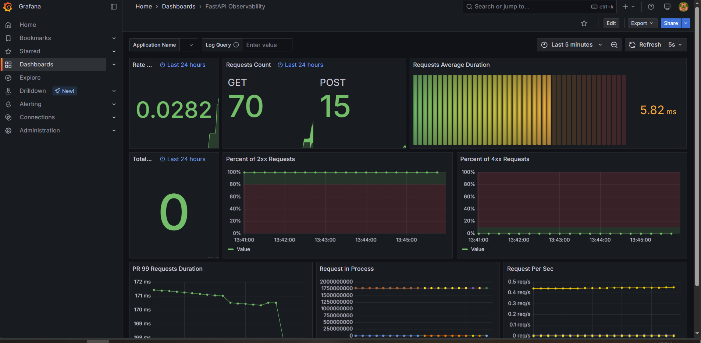
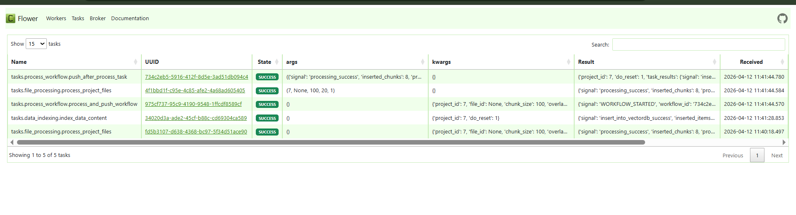

<!-- <p align="center">
  
</p> -->

<h1 align="center">Mini-RAG</h1>

<p align="center">
  <strong>Enterprise-Grade Document Intelligence Platform</strong><br/>
  <em>Production-ready RAG system with self-correcting AI, hybrid retrieval, and multi-modal document understanding</em>
</p>

<p align="center">
  
  
  
  
  
</p>

<p align="center">
  
  
  
  
  
  
  
</p>

---

## 🎯 Overview

**Mini-RAG** is a production-ready, enterprise-grade Retrieval-Augmented Generation system designed for **high-accuracy document retrieval and question answering** across multi-format, multi-lingual corpora. It goes far beyond basic RAG implementations by incorporating:

- 🧠 **Self-correcting AI workflow** via LangGraph with hallucination detection and iterative refinement
- 🔍 **5-stage advanced retrieval pipeline** — Multi-Query → HyDE → Hybrid Search → RRF Fusion → Cross-Encoder Reranking
- 📄 **Multi-modal document ingestion** — PDF, DOCX, PPTX, Images, URLs with OCR and embedded image extraction
- 🥪 **Hybrid text-image chunking** — Preserves contextual relationships between text and images within documents
- 🌍 **Native bilingual support** — Arabic + English with language-aware tokenization, chunking, and prompting
- 📊 **Comprehensive evaluation framework** — Automated benchmarking with 15+ metrics across retrieval, generation, and end-to-end quality
- 🏭 **Production infrastructure** — 12-service Docker Compose with monitoring, task queues, and health checks

> **This is not a tutorial project.** Every component is designed with production edge cases, error recovery, graceful degradation, and observability in mind.

---

## 🏗️ System Architecture

<p align="center">
  
</p>

The system operates as a **5-phase pipeline** with feedback loops:

```
┌────────────────────────────────────────────────────────────────────────────────────────┐
│                              DOCUMENT INTELLIGENCE PIPELINE                            │
├─────────────┬──────────────┬──────────────┬───────────────┬───────────────────────────┤
│  📄 INGEST  │  🧩 CHUNK    │  💾 INDEX    │  🔎 RETRIEVE  │  🤖 GENERATE              │
│             │              │              │               │                           │
│ Multi-format│ Hybrid       │ Vector DB    │ Multi-Query   │ LangGraph                 │
│ Loader      │ Text+Image   │ (PGVector/   │ Expansion     │ Self-Correcting           │
│      ↓      │ Chunker      │  Qdrant)     │      ↓        │ RAG Workflow              │
│ OCR Engine  │      ↓       │      +       │ Hybrid Search │      ↓                    │
│ (Tesseract) │ AI Context-  │ BM25 Index   │ (Dense+BM25)  │ Retrieve → Grade          │
│      ↓      │ ualizer      │              │      ↓        │   → Generate              │
│ Table       │              │              │ RRF Fusion    │   → Hallucination Check   │
│ Extractor   │              │              │      ↓        │   → Quality Audit         │
│             │              │              │ Cross-Encoder │   → Rewrite (if needed)   │
│             │              │              │ Reranking     │   → ✅ Final Answer        │
└─────────────┴──────────────┴──────────────┴───────────────┴───────────────────────────┘
```

---

## 🧠 Key Technical Innovations

### 1. Self-Correcting RAG with LangGraph

Unlike standard retrieve-and-generate pipelines, Mini-RAG implements a **state machine** that validates its own output:



**Each node** is backed by specialized LLM prompts with strict JSON output enforcement:
- **Retrieval Grader** — Scores each document's relevance before using it
- **Hallucination Auditor** — Verifies every claim traces back to source documents
- **Answer Quality Auditor** — Checks completeness, relevance, and specificity
- **Query Rewriter** — Reformulates queries using domain-specific terminology on failure

### 2. 5-Stage Advanced Retrieval Pipeline

Standard RAG retrieves top-K documents from a vector database. Mini-RAG implements a **multi-stage retrieval funnel** that maximizes both recall and precision:

| Stage | Technique | Purpose | Over-retrieval |
|-------|-----------|---------|---------------|
| 1 | **Multi-Query Expansion** | Generate 3 query variants to capture different phrasings | — |
| 2 | **HyDE (Hypothetical Document Embedding)** | Bridge query-document embedding gap | — |
| 3 | **Hybrid Search** | Parallel dense (vector) + sparse (BM25) retrieval | 6× top-k |
| 4 | **RRF Fusion** | Merge ranked lists with Reciprocal Rank Fusion (k=60) | 4× top-k |
| 5 | **Cross-Encoder Reranking** | Deep relevance scoring with Cohere Rerank v3 | → final top-k |

```python
# The pipeline in action (from NLPController.advanced_retrieve)
queries = self.multi_query_expander.expand(query)        # "contract termination" → 4 variants
for q in queries:
    dense, sparse = await hybrid_engine.search(q)        # Vector + BM25 per query
    all_results.extend([dense, sparse])
fused = self.rrf_fusion.fuse(*all_results, top_k=20)     # Rank-based fusion
final = self.reranker.rerank(query, fused, top_k=5)      # Cross-encoder rescoring
```

### 3. Hybrid Text-Image Chunking

Most RAG systems treat images as separate entities, losing their contextual relationship with surrounding text. Mini-RAG's `HybridChunker` solves this:

```
Traditional Approach:                    Mini-RAG Hybrid Approach:
┌──────────────┐ ┌──────────┐           ┌─────────────────────────────────┐
│  Text Chunk  │ │  Image   │           │  Text paragraph...              │
│  (no image   │ │  (no text│           │                                 │
│   context)   │ │  context)│           │  [Image 2: OCR extracted text   │
└──────────────┘ └──────────┘           │   from embedded diagram]        │
   ❌ Context lost                      │                                 │
                                        │  Continuation of text...        │
                                        └─────────────────────────────────┘
                                           ✅ Context preserved
```

**How it works:**
1. Groups documents by (source file, page number)
2. Extracts embedded images from PDF/DOCX/PPTX and runs OCR
3. Merges image text back into the document at natural break points
4. Chunks the enhanced text while tracking which images are referenced per chunk

### 4. AI-Powered Chunk Contextualization

Inspired by [Anthropic's Contextual Retrieval](https://www.anthropic.com/news/contextual-retrieval), each chunk is enriched with AI-generated context before indexing:

```
Before:  "The termination shall be effective immediately."
         ↑ What termination? Of what? Under which law?

After:   [Context: This chunk appears in Article 47 of the Egypt Labor Law No. 12/2003,
          discussing grounds for immediate employee contract termination.]
         "The termination shall be effective immediately."
         ↑ Now the embedding captures the full meaning
```

### 5. Production-Grade Resilience

- **4-level API key failover** — Primary → Backup → Backup2 → Backup3 with automatic switching on rate limits
- **Sliding window rate limiter** — 10 requests/minute with intelligent queuing
- **Idempotent task execution** — Prevents duplicate background processing
- **Graceful degradation** — Every component falls back to a simpler method (e.g., reranker fails → original order preserved)
- **Auto-rebuilding BM25 index** — Lazy-loaded from vector DB on first search

---

## 📊 Evaluation & Benchmarks

Mini-RAG includes a **built-in evaluation framework** that measures 15+ metrics across the full pipeline:

### Retrieval Metrics
| Metric | Description |
|--------|-------------|
| Hit Rate@K | At least one relevant doc in top-K results |
| MRR@K | Mean Reciprocal Rank of first relevant result |
| NDCG@K | Normalized Discounted Cumulative Gain |
| Precision@K / Recall@K | Standard IR metrics |
| Reranker MRR Lift | Quality improvement from cross-encoder reranking |
| Reranker ROI | Quality lift per unit latency |

### Generation Metrics
| Metric | Description |
|--------|-------------|
| Faithfulness | Every claim grounded in source documents (LLM-as-Judge) |
| Answer Relevance | Directly addresses the question |
| Completeness | Covers all aspects of the query |
| Abstention Quality | Correctly refuses unanswerable questions |
| Semantic Similarity | Embedding cosine similarity with reference answer |

### Latest Results (50 questions · 6 IoT technical documents)

```
╔════════════════════════════════╦══════════════════════╗
║           Metric               ║       Score          ║
╠════════════════════════════════╬══════════════════════╣
║  Semantic Similarity           ║       85.4%  🟢      ║
║  Abstention Quality            ║       88.0%  🟢      ║
║  Hit Rate @ 5                  ║       72.0%  🟢      ║
║  End-to-End Score (avg)        ║       73.6%  🟢      ║
║  Generation Score (avg)        ║       66.6%  🟡      ║
║  Reranker MRR Improvement      ║       +9.9%  📈      ║
║  Reranker Avg Latency          ║       418ms  ⚡      ║
╚════════════════════════════════╩══════════════════════╝
```

---

## 🏭 Production Infrastructure

The system deploys as a **12-service Docker Compose** stack with full observability:

```
                        ┌─────────────────────┐
                        │      Nginx          │ :80
                        │   (Reverse Proxy)   │
                        └─────────┬───────────┘
                                  │
                ┌─────────────────┼─────────────────┐
                │                 │                  │
       ┌────────▼──────┐ ┌───────▼────────┐ ┌──────▼───────┐
       │   FastAPI     │ │ Celery Worker  │ │  Celery Beat │
       │   App Server  │ │ (5 queues)     │ │  (Scheduler) │
       │   :8000       │ │                │ │              │
       └───────┬───────┘ └───────┬────────┘ └──────────────┘
               │                 │
    ┌──────────┼─────────────────┼──────────────────┐
    │          │                 │                   │
┌───▼───┐ ┌───▼───┐      ┌─────▼─────┐      ┌─────▼─────┐
│PGVec- │ │Qdrant │      │ RabbitMQ  │      │   Redis   │
│tor    │ │       │      │  (Broker) │      │ (Results) │
│:5432  │ │:6333  │      │  :5672    │      │  :6379    │
└───────┘ └───────┘      └───────────┘      └───────────┘

┌─────────────────────────────────────────────────────────┐
│                    OBSERVABILITY LAYER                   │
│  Prometheus (:9090) → Grafana (:3000)                   │
│  Node Exporter (:9100) · PG Exporter (:9187)            │
│  Flower Dashboard (:5555)                                │
└─────────────────────────────────────────────────────────┘
```

<p align="center">
  
  <br/>
  <em>Real-time system monitoring with Grafana</em>
</p>

<p align="center">
  
  <br/>
  <em>Celery task monitoring with Flower</em>
</p>

---

## 📂 Project Structure

```
mini-rag/
│
├── src/
│   ├── main.py                        # FastAPI application entry point
│   ├── celery_app.py                  # Distributed task queue configuration
│   │
│   ├── controllers/                   # Business logic layer
│   │   ├── NLPController.py           # Core orchestrator (indexing, search, Q&A)
│   │   ├── ProcessController.py       # Document ingestion pipeline
│   │   ├── EvaluationController.py    # Evaluation workflow
│   │   └── DataController.py          # File upload & validation
│   │
│   ├── ingestion/                     # Document processing pipeline
│   │   ├── loaders.py                 # Multi-format document loading (PDF/DOCX/PPTX/IMG/URL) 
│   │   ├── ocr.py                     # Tesseract OCR engine + image preprocessing 
│   │   ├── chunker.py                 # Context-aware sentence-level chunking 
│   │   ├── hybrid_chunker.py          # ⭐ Hybrid text-image chunking 
│   │   └── contextualizer.py          # AI-powered chunk contextualization 
│   │
│   ├── retrieval/                     # Advanced retrieval pipeline
│   │   ├── hybrid_search.py           # Dense (vector) + Sparse (BM25) search 
│   │   ├── rrf.py                     # Reciprocal Rank Fusion 
│   │   ├── reranker.py                # Cross-encoder reranking (Local + Cohere)
│   │   ├── multi_query.py             # LLM-powered query expansion 
│   │   └── hyde.py                    # Hypothetical Document Embedding 
│   │
│   ├── graph/                         # Self-correcting RAG
│   │   ├── rag_graph.py               # ⭐ LangGraph state machine 
│   │   └── prompts.py                 # Engineered prompt library 
│   │
│   ├── evaluation/                    # RAG evaluation framework
│   │   ├── dataset_generator.py       # Auto-generates Q&A evaluation datasets
│   │   ├── evaluator.py               # 15+ metric comprehensive evaluator 
│   │   ├── generation_metrics.py      # Faithfulness/Relevance/Completeness scoring
│   │   └── cli.py                     # CLI for running evaluations
│   │
│   ├── stores/                        # Provider abstractions (Strategy Pattern)
│   │   ├── llm/                       # OpenAI + Cohere providers
│   │   └── vectordb/                  # PGVector + Qdrant providers
│   │
│   ├── factories/                     # Dependency injection & wiring
│   │   └── nlp_factory.py             # Assembles retrieval pipeline components
│   │
│   ├── tasks/                         # Celery background tasks
│   │   ├── file_processing.py         # Async document processing
│   │   ├── data_indexing.py           # Async vector DB indexing
│   │   ├── process_workflow.py        # Combined processing pipeline
│   │   └── maintenance.py             # 24-hour cleanup scheduler
│   │
│   ├── models/                        # SQLAlchemy ORM + Alembic migrations
│   ├── routes/                        # FastAPI REST API endpoints
│   ├── helpers/                       # Configuration (pydantic-settings)
│   └── utils/                         # Metrics, idempotency management
│
├── docker/                            # Production deployment
│   ├── docker-compose.yml             # 12-service orchestration
│   ├── nginx/                         # Reverse proxy config
│   ├── prometheus/                    # Metrics collection
│   └── rabbitmq/                      # Message broker config
│
└── docs/                              # Documentation & screenshots
```

---

## 🚀 Getting Started

### Prerequisites

- Python 3.10+
- Docker & Docker Compose
- Cohere API key (primary LLM/Embedding provider)

### Option 1: Full Docker Deployment

```bash
# Clone the repository
git clone https://github.com/yourusername/mini-rag.git
cd mini-rag

# Configure environment
cp docker/env/.env.app.example docker/env/.env.app
# Edit .env.app with your API keys

# Launch all 12 services
cd docker
docker compose up -d

# Verify
curl http://localhost/api/v1/
```

### Option 2: Local Development

```bash
# Create conda environment
conda create -n mini-rag python=3.10
conda activate mini-rag

# Install dependencies
pip install -r src/requirements.txt

# Start infrastructure services only
cd docker
docker compose up -d pgvector rabbitmq redis

# Configure
cp src/.env.example src/.env
# Edit .env with your settings

# Run the application
cd src
uvicorn main:app --reload --host 0.0.0.0 --port 5000
```

### Quick Start: Process Your First Document

```bash
# 1. Upload a document
curl -X POST "http://localhost:5000/api/v1/data/upload/1" \
  -F "file=@document.pdf"

# 2. Process & chunk
curl -X POST "http://localhost:5000/api/v1/data/process/1" \
  -H "Content-Type: application/json" \
  -d '{"file_id": "document.pdf", "chunk_size": 512, "overlap_size": 64}'

# 3. Index into vector DB
curl -X POST "http://localhost:5000/api/v1/nlp/index/push/1?do_reset=0"

# 4. Ask a question
curl -X POST "http://localhost:5000/api/v1/nlp/index/answer/1" \
  -H "Content-Type: application/json" \
  -d '{"text": "What are the key findings in this document?"}'
```

---

## ⚙️ Configuration

All settings managed via `.env` with **pydantic-settings** for type validation:

| Category | Key Settings | Default |
|----------|-------------|---------|
| **LLM** | `GENERATION_BACKEND`, `EMBEDDING_BACKEND` | `COHERE` |
| **Embedding** | `EMBEDDING_MODEL_ID`, `EMBEDDING_MODEL_SIZE` | `embed-multilingual-light-v3.0`, `384` |
| **Vector DB** | `VECTOR_DB_BACKEND`, `VECTOR_DB_DISTANCE_METHOD` | `PGVECTOR`, `cosine` |
| **Resilience** | `COHERE_API_KEY`, `_BACKUP`, `_BACKUP2`, `_BACKUP3` | 4-level failover |
| **Language** | `PRIMARY_LANG`, `DEFAULT_LANG` | `ar`, `en` |
| **Celery** | `CELERY_BROKER_URL`, `CELERY_RESULT_BACKEND` | RabbitMQ + Redis |
| **Limits** | `FILE_MAX_SIZE`, `CELERY_TASK_TIME_LIMIT` | `10` MB, `600`s |

---

## 🧪 Evaluation CLI

Run comprehensive benchmarks against your indexed documents:

```bash
# Generate evaluation dataset from indexed documents
python -m evaluation.cli generate --project-id 1 --num-questions 50

# Run full evaluation
python -m evaluation.cli evaluate --project-id 1 --advanced --output results/

# View results
python -m evaluation.cli report --results-path results/latest.json
```

**Evaluated dimensions:**
- **Retrieval**: Precision, Recall, F1, Hit Rate@K, MRR@K, NDCG@K
- **Generation**: Faithfulness, Relevance, Completeness, Abstention Quality, Semantic Similarity
- **Reranker**: MRR/NDCG lift, latency profiling, ROI analysis
- **End-to-End**: Combined retrieval + generation performance

---

## 🔧 Tech Stack

| Layer | Technology | Purpose |
|-------|-----------|---------|
| **API** | FastAPI 0.110 | Async REST API with auto-docs |
| **LLM** | Cohere / OpenAI | Generation + Embeddings |
| **Orchestration** | LangGraph 0.2.50 | Self-correcting RAG state machine |
| **Vector DB** | PGVector · Qdrant | Semantic similarity search |
| **Keyword Search** | BM25 (rank-bm25) | Sparse lexical retrieval |
| **Reranking** | Cohere Rerank v3 · BAAI/bge-reranker-v2-m3 | Cross-encoder relevance scoring |
| **OCR** | Tesseract + OpenCV | Multi-language document scanning |
| **ORM** | SQLAlchemy 2.0 (async) + Alembic | Database management + migrations |
| **Task Queue** | Celery + RabbitMQ + Redis | Distributed background processing |
| **Monitoring** | Prometheus + Grafana + Flower | Metrics, dashboards, task monitoring |
| **Proxy** | Nginx | Load balancing + reverse proxy |
| **Container** | Docker Compose | 12-service orchestration |

---

## 📈 Design Decisions & Trade-offs

| Decision | Rationale |
|----------|-----------|
| **Hybrid chunking over separate image indexing** | Preserving text-image context proximity dramatically improves retrieval relevance for documents with diagrams, tables in images, and annotated figures |
| **RRF over learned fusion** | RRF is model-free, requires no training data, and works across different score scales (cosine similarity vs BM25). More robust in production than learned weighting |
| **Cross-encoder reranking as final stage** | Bi-encoders are fast but shallow; cross-encoders see query+document jointly. Placing reranking after RRF gives it the best candidate pool while keeping latency acceptable (~418ms) |
| **LangGraph over chain-of-thought** | State machines provide explicit control flow, better observability, and deterministic retry logic compared to free-form chain prompting |
| **PGVector as primary (not Qdrant)** | Co-locates vectors with relational metadata in a single PostgreSQL instance, reducing operational complexity. Qdrant available as alternative for scale-out scenarios |
| **4-level API key failover** | Sustained evaluation runs (50+ questions) can exhaust single API quotas. Cascading keys with rate limiting ensure uninterrupted operation |
| **Arabic-first design** | OCR (`ara+eng`), BM25 tokenization, sentence splitting regex, and all prompts handle Arabic natively — not as an afterthought |

---

## 🤝 Contributing

Contributions are welcome! Areas of active development:

- [ ] Streaming generation responses
- [ ] Multi-tenant project isolation
- [ ] Fine-tuned reranker on domain-specific data
- [ ] PDF table structure preservation in chunks
- [ ] WebSocket real-time processing status

---

## 📄 License

This project is licensed under the Open Source License — see the [LICENSE](LICENSE) file for details.

---

<p align="center">
  <strong>Built with ❤️ and a passion for building AI systems that actually work in production.</strong>
</p>

